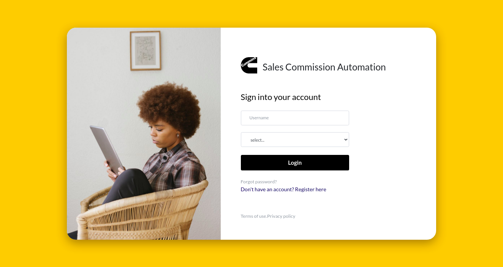

## Sales Commission Automation

> An app built to fetch sales commission records from an API, to render the summaries of the data.

   

## Built with

- React
- SCSS (Bootstrap)
- Linter (Stickler)
- 

## Live demo

[Live Demo Link](https://demo-analysis.netlify.app)

## Getting started

### Setup

To setup this project on your development environment, follow the steps below:

- On the project GitHub page, navigate to the main page of the repository ([this page](https://github.com/teekaytech/demo-app-client)).
- Under the repository name, locate and click on a green button named `Code`.
- Copy the project URL as displayed (`https://github.com/teekaytech/demo-app-client.git`).
- If you're running Windows Operating System, open your command prompt. On Linux, Open your terminal.
- Change the current working directory to the location where you want the cloned directory to be made. Leave as it is if the current location is where you want the project to be.
- Type git clone, and then paste the URL you copied in Step 3.
  `$ git clone https://github.com/teekaytech/demo-app-client.git`
- Press the `Enter` button. Your local copy will be created.

Note: you must have `npm`, `Node`, & `Git` installed on your PC to setup the app locally.

### Starting the app

Install packages with:

`npm install`

Start the application locally with:

`npm start`

The app should automatically open a local development server. If it does not, open `http://localhost:3000` on your browser.

## Author

**Taofeek Olalere**

- [Portfolio](https://taofeekolalere.me/)
- [Twitter](https://twitter.com/ola_lere)
- [LinkedIn](https://www.linkedin.com/in/olaleretaofeek/)

## Contributing

Contributions, issues and feature requests are welcome!

1.  Fork the Project [here](https://github.com/teekaytech/demo-app-client)
2.  Open a Pull Request

Feel free to check the [issues page](https://github.com/teekaytech/demo-app-client/issues).

## Show your support

Give a :star: if you like this project!
